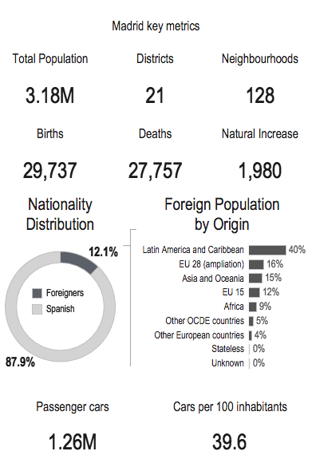
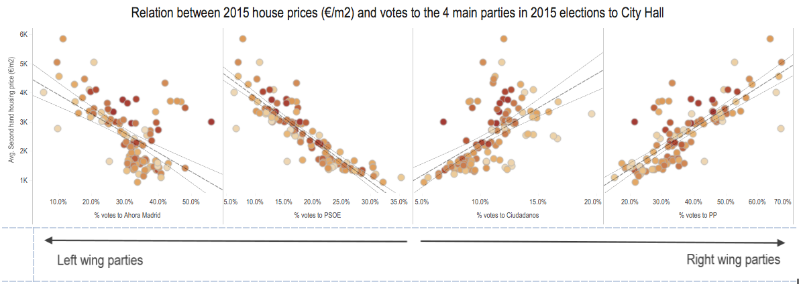
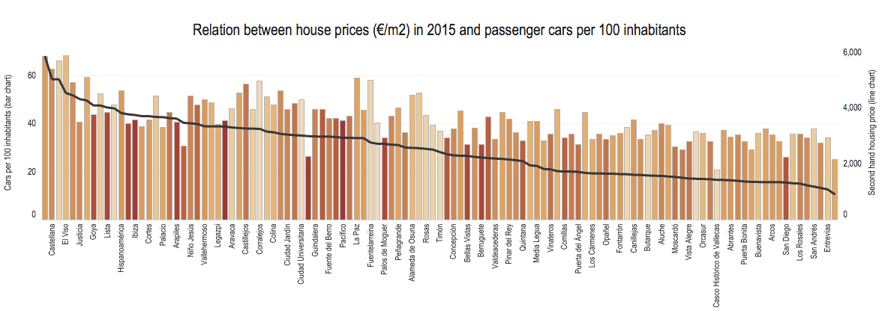

## Madrid City Quick Insights

*"Madrid is the capital city of Spain and the largest municipality of the Kingdom of Spain. The city has a population of almost 3.2 million and it is the third-largest city in the European Union, after London and Berlin."* [ ^1^ ](#references) 

This is short insight into population data of Madrid using the report provided by Udacity [ ^1^ ](#references) 

### Insights
{ width=250px }
*Figure 1*

In figure 1, we can see that of the 3.18 million inhabitants in Madrid 12.1% of these are foreigners - this would be roughly 384,000 foreign inhabitants, which is a large population in of itself. The largest group with 40% of foreigners within Madrid is the 'Latin American and Caribbean' group, that's just over 150,000 inhabitants.

*Figure 2*

In figure 2, we have another interesting set of data. We can see based of this chart, that it's clear that the house prices within the area has a correlation with the percentage of votes for particular political parties. We can see that on average, the higher the house prices in the area, the more votes there are for the right wing parties.

*Figure 3*

Continuing with the theme of house prices, in figure 3 we can see the relation between house prices and car ownership within each neighbourhood. Higher car ownership appears to correlate with higher house prices within the neighbourhood. For example, San Cristóbel has about 25 cars per 100 inhabitants, and the house prices there are on average 925 euros per metre squared.

### References

1\
[Madrid Tableau Report](https://video.udacity-data.com/topher/2020/February/5e5801c1_madrid-in-detail/madrid-in-detail.twbx)
